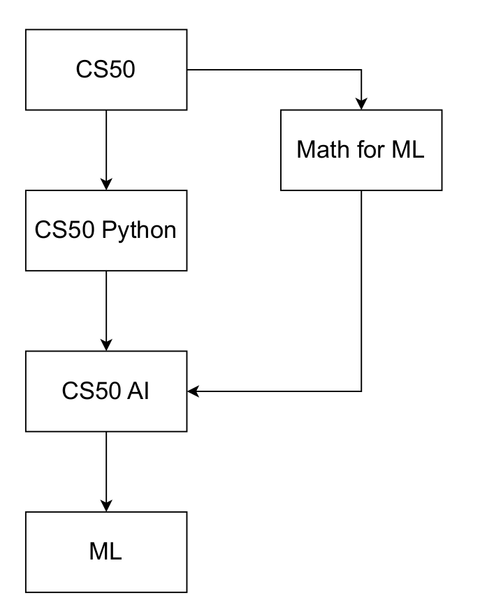
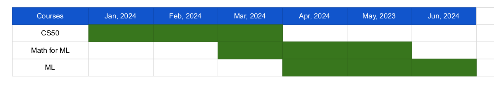

# Course flow

## Approximate total time

| course | Hour | Week | Hour-Week | Time |
|--------|------|------|-----------|-------|
| [CS50](https://cs50.harvard.edu/x/2023/) | 12 | 12 | 12 - 12| 3 months |
| [Math for ML](https://www.coursera.org/specializations/mathematics-for-machine-learning-and-data-science) | 05 | 12 | 05 - 12 | 3 months |
| [CS50 Python](https://cs50.harvard.edu/python/2022/) | 06 | 13 | 06 - 13 | 3 months 1 week |
| [CS50 AI](https://cs50.harvard.edu/ai/2023/) | 20 | 11 | 20 - 11 | 2 months 3 weeks |
| [ML](https://www.coursera.org/specializations/machine-learning-introduction) | 10 | 08 |  10 - 08 | 2 months |
| Total time | - | - | 20 - 56 | 14 months |

Required Time: 1.5 years

## Timeline [Jan, 2024 - Jun, 2024]

